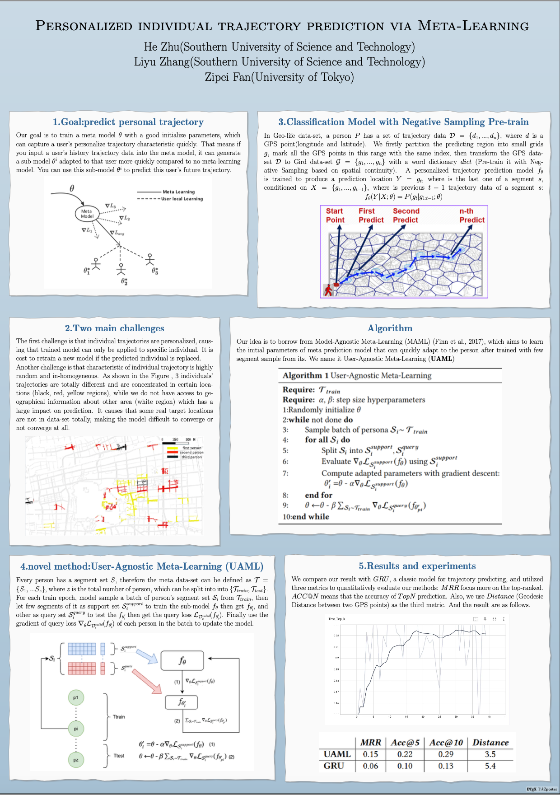

The poster of UAML on 2022 SIGSPATIAL.

[Download paper here](https://github.com/zhuchichi56/zhuchichi56.github.io/blob/master/files/Poster_of_Personalized_individual_trajectory_prediction_via_Meta_Learning.pdf)

